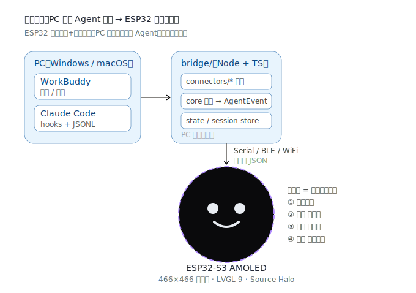
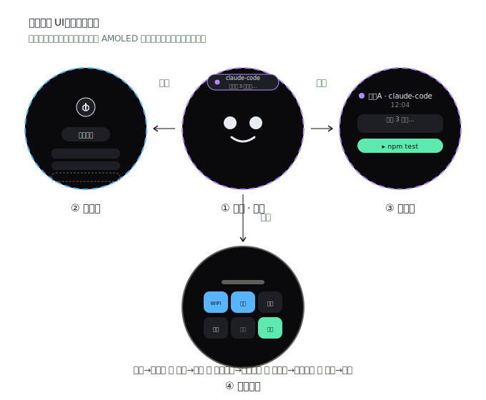

# DeskPet Agent · ESP32 圆形屏桌宠（联动 WorkBuddy / Claude Code）

一个跑在 **ESP32-S3 圆形 AMOLED（466×466）** 上的桌宠 Agent：把 **Windows / Mac 端的 WorkBuddy**
与 **Claude Code CLI** 的活动，实时显示在一块圆形触摸屏上。宠物按 Agent 状态变表情、收到消息弹通知；
**左滑**进负一屏（语音 + 硬件状态），**右滑**切到下一个会话（按时间排序），**上下滑**浏览当前会话内容，**首页下滑**拉出控制中心（蓝牙 / WiFi / 设置等快捷开关），
**底边上滑**任意屏直接回主页；主机失联时桌宠显示「未连接」灰态。

> 交互模型（状态机桌宠 + Agent 联动）参考 [clawd-on-desk](https://github.com/rullerzhou-afk/clawd-on-desk)，
> 但**渲染目标从桌面窗口改为 ESP32 圆形屏**，PC 端只负责「采集 Agent 事件并下发」。

---

## 两个角色

| 角色 | 跑在哪 | 干什么 |
|---|---|---|
| **firmware/** | ESP32-S3 AMOLED | LVGL 9 画圆形 UI、识别触摸滑动、接收并显示事件、回传指令 |
| **bridge/** | Windows / macOS | 用 Hook + JSONL 采集 WorkBuddy / Claude Code 事件 → 聚合成 `AgentEvent` → 经串口/BLE/WiFi 下发 |

## 四个界面（都在圆形屏上，靠滑动切换）

| 界面 | 进入手势 | 作用 |
|---|---|---|
| **① 主页面（桌宠）** | 默认 | 宠物按状态变表情；收到消息时边缘高亮 + 通知气泡 |
| **② 负一屏** | 向左滑 | 语音输入按钮、硬件状态（ESP32 自身电量/WiFi + 系统） |
| **③ 会话页** | 向右滑 | 展示**单个**会话：最新回复 + 「下一步做什么」；右滑=下一个会话，上下滑=翻看该会话内容 |
| **④ 控制中心** | 从首页**向下滑** | 智能手表式快捷开关：WiFi / 蓝牙 / 设置 / 亮度 / 勿扰 / 传输；上滑或点手柄返回 |

## 视觉稿（设计图）

### 系统架构


### 圆形屏界面与滑动导航


> 四屏在同一圆形画布上切换：左滑负一屏、右滑会话、首页下滑控制中心、上下滑翻内容。

- [`docs/visuals/architecture.svg`](docs/visuals/architecture.svg) —— 系统架构：PC 采集 → ESP32 圆形屏
- [`docs/visuals/screens.svg`](docs/visuals/screens.svg) —— 四屏圆形 UI 与滑动导航
- [`docs/visuals/pet.svg`](docs/visuals/pet.svg) —— ① 主页桌宠
- [`docs/visuals/negative.svg`](docs/visuals/negative.svg) —— ② 负一屏
- [`docs/visuals/session.svg`](docs/visuals/session.svg) —— ③ 会话页
- [`docs/visuals/control.svg`](docs/visuals/control.svg) —— ④ 控制中心

## 技术栈

- **设备端**：ESP-IDF v5.5 + **LVGL 9**（沿用 workspace 里的 `ESP32-S3-AMOLED开发指南.md` 与 `my_first_app` 模板）。
- **PC 端**：Node + TypeScript，连接器抽象层 + 串行/无线传输。
- **协议**：`shared/protocol.md` —— 一行一条 JSON（`AgentEvent` 下行 / `Command` 上行）。
- **圆形约束**：所有 UI 必须落在 466×466 的圆内（安全半径 ~210），用环形进度/弧形文案，不做溢出矩形。

## 快速开始

### 设备端 demo（已可用）

固件 demo 已实现四屏 UI、mock 数据、点击切换状态，无通信：

```bash
cd firmware
idf.py set-target esp32s3
idf.py build flash monitor
```

详见 [`firmware/README.md`](firmware/README.md)。

### PC 端（规划中）

```bash
# PC 端：采集 Agent 事件并下发到 ESP32
cd bridge && npm install
npm run install:hooks     # 向 Claude Code 注入钩子（可选）
npm run dev               # 连上串口/设备，开始下发事件
```

## 目录与文档

- [`docs/DESIGN-SYSTEM.md`](docs/DESIGN-SYSTEM.md) —— 统一设计系统：色彩、字体、间距、动效、Source Halo
- [`docs/PROJECT-LAYOUT.md`](docs/PROJECT-LAYOUT.md) —— 完整目录树
- [`docs/ARCHITECTURE.md`](docs/ARCHITECTURE.md) —— ESP32 + PC 桥接架构与数据流
- [`docs/SPEC-DESKTOP-PET.md`](docs/SPEC-DESKTOP-PET.md) —— 圆形主页面（桌宠）
- [`docs/SPEC-NEGATIVE-SCREEN.md`](docs/SPEC-NEGATIVE-SCREEN.md) —— 左滑负一屏
- [`docs/SPEC-SESSION-SCREEN.md`](docs/SPEC-SESSION-SCREEN.md) —— 会话页（右滑/上下滑）
- [`docs/SPEC-CONTROL-CENTER.md`](docs/SPEC-CONTROL-CENTER.md) —— ④ 下拉控制中心（蓝牙/WiFi/设置）
- [`docs/AGENT-LINK.md`](docs/AGENT-LINK.md) —— 如何联动 WorkBuddy 与 Claude Code
- [`shared/protocol.md`](shared/protocol.md) —— 通信协议
