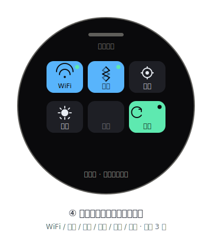

# 屏④ 控制中心（Control Center · 圆形屏）

参考智能手表：从主桌宠**向下滑**拉出圆形下拉控制中心，集中放置快捷开关。
**上滑**或点顶部手柄返回主页。

> 视觉规范参考 [`DESIGN-SYSTEM.md`](DESIGN-SYSTEM.md)。

## 1. 进入 / 退出

| 手势 | 行为 |
|---|---|
| 从首页**向下滑** | 拉出控制中心（覆盖圆形画布） |
| 在控制中心**向上滑** / 点顶部手柄 | 收起，返回首页 |
| 点开关 tile | 执行对应动作（切换 / 进入设置） |

> 仅在**首页**可下拉出控制中心（与手表表盘一致）；其他视图的下滑仍用于翻看内容。

## 2. 开关 tile 布局（圆形 466×466，安全半径≈210）

3 列 × 2 行的圆角 tile 网格（**一排 3 个**），居中分布，全部落在安全圆内：

| 位置 | Tile | 默认 | 点击行为 |
|---|---|---|---|
| 上左 | **WiFi** | 开 | 切换 ESP32 WiFi 连接（激活时显示当前 SSID） |
| 上中 | **蓝牙** | 开 | 切换 BLE 广播（与手机 / PC 配对） |
| 上右 | **设置** | — | 进入设置屏（亮度 / 传输 / 关于，规划中） |
| 下左 | **亮度** | 中 | 循环亮度档位（暗 → 中 → 亮） |
| 下中 | **勿扰** | 关 | 静音 Agent 通知（上行 `mute_toggle`） |
| 下右 | **传输** | 串口 | 切换下行通道：串口 / BLE / WiFi |

- 开启态：tile 填充 `workblue`（WiFi / 蓝牙）或 `mint`（传输）；右上角 `mint` 指示点。
- 关闭态：tile 填充 `stone`，图标/文字用 `mist` 40% 透明度（勿扰默认灰）。
- 设置 tile 使用 `stone` 填充，无开关态。
- 顶部：拖拽手柄 + 「控制中心」标题（T4）；底部提示「点开关 · 上滑返回主页」。
- 控制中心背景使用 `void` `#0A0A0C`，tile 尽量紧凑，减少发光面积。

## 3. 与 bridge 的边界

| 开关 | 作用域 | 是否上行 |
|---|---|---|
| WiFi / 蓝牙 / 亮度 / 传输 | ESP32 本地硬件 | 否（仅本地生效） |
| 设置 | 本地设置屏 | 否 |
| 勿扰（静音 Agent 通知） | 影响 PC 端是否下发通知 | **是** → `Command {cmd:"mute_toggle", value}` |

> 控制中心不是 Agent 联动的一部分，而是设备自身的快捷面板——和负一屏（只读硬件状态 + 语音）互为补充：
> **负一屏看「状态」，控制中心做「操作」**。

## 4. 文件（规划占位）

- `firmware/main/ui_control.cpp` —— 控制中心绘制 + tile 事件
- 手势入口在 `gesture.c`：首页**下滑** → `ui_control_show()`；上滑 / 点手柄 → `ui_control_hide()`
