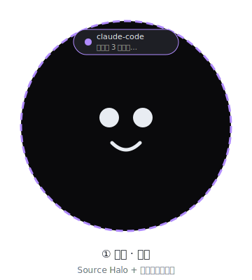

# 屏① 主页面 · 圆形桌宠（ESP32 466×466）

> 视觉规范参考 [`DESIGN-SYSTEM.md`](DESIGN-SYSTEM.md)。

## 1. 屏幕与画布

| 属性 | 值 |
|---|---|
| 分辨率 | 466 × 466，**圆形**（圆角即屏边，无直角） |
| 安全区 | 内容半径 ≈ 210px，超出部分会被圆形裁切 |
| 渲染 | LVGL 9，单画布多视图（非多窗口） |
| 背景 | `#0A0A0C` 纯黑，AMOLED 省电 |
| 默认视图 | 桌宠居中，Source Halo 在外缘 |

## 2. Source Halo（主页状态光）

屏幕外缘 2–4 px 的细环作为设备「情绪灯」，颜色与动画由当前状态/来源决定：

| 状态/来源 | Halo 颜色 | 动画 |
|---|---|---|
| WorkBuddy 活跃 | `workblue` `#58B4FC` | 顺时针扫过，周期 2s |
| Claude Code 活跃 | `claudepurple` `#B18CFF` | 逆时针 shimmer，周期 2s |
| 系统/成功 | `mint` `#5EE9B0` | 稳定微光 |
| 权限请求 | `amber` `#FBBF24` | 慢呼吸 |
| 错误 / 断连 | `coral` `#F87171` | 快速三连闪后常亮 |
| 新通知 | 来源色 | 径向脉冲 1.5s，持续 5s |

Halo 在四屏中保持连续，强化同一画布感知。

## 3. 表情状态机（核心）

表情由 `pet_states.c`（移植自 `bridge/core/state-machine.ts` 的优先级）驱动。
状态与表情映射（12 态，与参考项目同源）：

| PetState | 圆形屏上的表现 |
|---|---|
| `disconnected` | 灰阶 + 断连图标（云打斜杠）；**主机/链路未连接时强制显示，优先级最高** |
| `idle` | 中心小宠发呆、偶尔眨眼 |
| `thinking` | 头顶转圈思考环 |
| `typing` | 嘴部动效 |
| `building` | 边缘进度环转动 |
| `notification` | ！脸 + **Source Halo 来源色脉冲**（收到消息） |
| `waiting` | 摊手等输入 |
| `permission` | 举手请求（Halo `amber`） |
| `speaking` | 嘴部声波 |
| `happy` | 笑脸 + 小跳 |
| `error` | 哭脸 + Halo `coral`（Agent 报错） |
| `sleeping` | 趴下 + Zzz（无操作 ≥60s） |

> `disconnected` 由**设备端**检测（transport 链路断开 / 心跳超时 / bridge 未启动），不由 `AgentEvent` 下发：一旦失联，`pet_states.c` 直接覆盖为该态，忽略上次缓存的 Agent 状态；链路恢复后切回 `idle` 或最近真实状态。
> 动画用 LVGL 的 `lv_anim_*`；注意圆形屏 PSRAM 有限，资源用 SVG/简笔路径而非 GIF。

## 4. 收到 Agent 消息的通知（圆形友好）

事件 `type === 'message' | 'notification'` 到达时：

1. 宠物切 `notification` 表情。
2. **Source Halo** 沿外缘以来源色脉冲：WorkBuddy 为 `workblue` `#58B4FC`，Claude Code 为 `claudepurple` `#B18CFF`。
3. 在**圆心上方**弹出一个圆角胶囊气泡（落在安全区内）：
   - 标题：`sessionName`（哪个 Agent / 会话），前带一个来源色小点。
   - 正文：`text` 截断 ~40 字（圆形屏单行窄），更长则提示「上下滑查看」。
   - 来源角标：小图标。
4. 约 5s 自动淡出；用户**点按**气泡可展开查看完整内容。
5. 多条消息排队时，用 Halo 上的最多 3 个小段标记代替堆叠气泡，避免遮挡。

> 旧版「粉色边缘高亮环」已废弃，统一为 Source Halo 来源色脉冲。

## 5. 圆形屏上的手势（关键修正）

整个圆形是一块连续触摸屏（CST820）。没有「窗口拖拽」，只有**滑动方向**：

| 手势 | 行为 |
|---|---|
| **向左滑** | 主页 → 进入 **负一屏**（屏②）；会话页 → 上一个会话 |
| **向右滑** | 主页 → 进入 **会话页**定位到「当前/最近」会话（屏③）；会话页 → 下一个会话 |
| **向下滑（仅首页）** | 拉出 **控制中心**（屏④）：WiFi / 蓝牙 / 设置 / 亮度 / 勿扰 / 传输；上滑或点手柄返回 |
| **上滑 / 下滑（非首页）** | 在当前视图内滚动内容（如展开通知、翻看会话历史） |
| **从屏幕最下边缘向上滑** | **全局回家**：任意屏直接回主页（与普通上滑靠起点 y 区分） |
| 点按宠物 | 戳一下（表情抖一抖） |
| 长按 | 弹出迷你菜单（亮度 / 退出 / 切换传输） |

> 主页与各会话是**同级卡片**，横向序列 `主页 ↔ 会话1 ↔ … ↔ 会话N` 循环滑动；负一屏是主页的侧分支（主页左滑进入、负一屏右滑回主页）；控制中心是首页的下拉覆盖层（首页下滑进入、上滑/点手柄退出），不进入横向卡片序列。
> 手势方向由 `gesture.c` 根据触摸轨迹的 dx/dy 主分量判定（阈值可配）；「底边上滑回家」要求起点落在底部约 24px 边缘区。

## 6. 文件

- `firmware/main/ui_pet.cpp` —— 圆形桌宠绘制 + 通知气泡
- `firmware/main/pet_states.c` —— 表情状态机
- `firmware/main/gesture.c` —— 滑动方向识别
- `firmware/main/app_main.cpp` —— LVGL 初始化与视图切换入口
