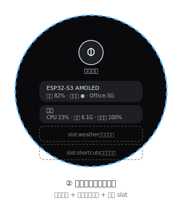

# 屏② 左滑负一屏（Negative Screen · 圆形屏）



> 视觉规范参考 [`DESIGN-SYSTEM.md`](DESIGN-SYSTEM.md)。

从主桌宠**向左滑**进入，是同一圆形画布上的第二视图（非独立窗口）。

## 1. 圆形布局（中心放射 / 居中堆叠）

```
        ┌─────────── 圆形 466 ───────────┐
        │        [ ● ] 语音按钮           │  ← 屏幕上方居中，点击说话
        │      空闲 / 录音中…             │
        │                                 │
        │   ┌─ 设备 ─────────────────┐    │
        │   │ ESP32-S3 AMOLED        │    │
        │   │ 电量 82% · 充电中 ●    │    │
        │   │ WiFi: Office-5G        │    │
        │   └────────────────────────┘    │
        │   ┌─ 系统 ─────────────────┐    │
        │   │ CPU 23% · 内存 6.1G    │    │
        │   │ 笔记本电量 100%        │    │
        │   └────────────────────────┘    │
        │   ┌─ slot:weather ─────────┐    │  ← 预留组件位
        │   │ （未启用）              │    │
        │   └────────────────────────┘    │
        │   ┌─ slot:shortcuts ───────┐    │
        │   │ （未启用）              │    │
        │   └────────────────────────┘    │
        │  （底部小提示：右滑返回主页）    │
        └─────────────────────────────────┘
```

> 圆形屏空间有限，信息**纵向居中堆叠**，每张卡控制在安全半径内；长文本截断。背景为 `#0A0A0C` 纯黑，卡片使用 `stone` `#1E1F25`。

## 2. 语音输入按钮

- 形态：屏幕上方居中的**圆形点击按钮**（直径 48 px），mic 图标。
- 流程（圆形屏 + PC 协作）：
  1. 用户**点按**按钮 → ESP32 回传 `Command {cmd:"voice_start"}` 给 `bridge`。
  2. `bridge` 在 PC 端采集麦克风 → STT（本地 `whisper.cpp` / 云端，可配）→ 文本。
  3. `bridge` 把文本作为用户指令发给「当前激活 Session」的 Agent。
- 状态：

| 状态 | 视觉 | 说明 |
|---|---|---|
| 空闲 | `stone` 填充 + `mist` mic 图标 | 等待点击 |
| 录音中 | `coral` 脉冲环 + "聆听中" | 按钮外圈 800 ms 不透明度脉冲 |
| 识别中 | `workblue` 转圈 + "识别中" | 环上小点旋转 |
| 已发送 | `mint` 对勾 + "已发送" | 1s 后自动切回空闲 |

- 也可在 ESP32 端接麦克风（板载双麦）本地识别，再把文本回传——见 `ESP32-S3-AMOLED开发指南.md` 音频章节。

## 3. 硬件状态卡

数据来自 `HardwareStatus`（由 `bridge` 聚合后随 `AgentEvent` 下发，或设备自报）：

| 字段 | 说明 | 来源 |
|---|---|---|
| `device` | 设备名 | 配置 |
| `connected` | 在线 | 串口/BLE 探测 |
| `batteryPct` | 电量 % | ESP32 `batt_get_voltage` |
| `charging` | 充电中 | ESP32 `batt_get_status` |
| `wifi` | 网络名 | ESP32 WiFi 状态 |

系统级（CPU/内存/笔记本电量）由 `bridge` 经 Node `os` + 系统 API 采集后下发。

> 注意：`HardwareStatus` 不包含温度字段，负一屏不显示温度。

## 4. 预留组件位（Slot 契约）

- 用占位卡片（`stone` 虚线框 + `mist` 标题 `slot:xxx`）表达后续插件挂载点。
- 约定：每个 slot 圆形内自适应、统一卡片风格、默认「未启用」灰色状态。
- 新增组件不改本屏结构，只注册一个渲染器挂到对应 slot。
- 当前预留：`slot:weather`、`slot:shortcuts`。

## 5. 文件

- `firmware/main/ui_negative.cpp` —— 语音按钮 + 硬件卡 + slot 占位
- `bridge/src/transport.ts` —— 语音/指令上行与状态下行
