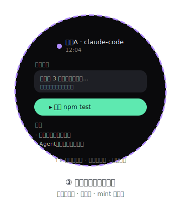

# 屏③ 会话页（Session · 圆形屏）



> 视觉规范参考 [`DESIGN-SYSTEM.md`](DESIGN-SYSTEM.md)。

从主桌宠**向右滑**进入。本屏**一次只展示一个会话**，靠滑动在会话间与内容间导航。

## 1. 核心交互（已修正）

**会话页与主页是同级卡片**，组成一条横向序列：
`[主页] ↔ [会话1] ↔ [会话2] ↔ … ↔ [会话N]`，右滑前进、左滑后退，到尽头循环。
因此会话页内**不需要专门的「退回主页」手势**——左滑到尽头（会话1 再左滑）自然回到主页；
需要快速回家时用底边上滑（见下）。

| 手势 | 行为 |
|---|---|
| **向右滑** | 切到**下一个会话**（按时间排序循环） |
| **向左滑** | 回到上一个会话；会话1 左滑 → **主页** |
| **上滑 / 下滑** | 在当前会话内**翻看内容**（最新回复 ↔ 历史消息 ↔ 「下一步」） |
| **从屏幕最下边缘向上滑** | 直接回到**主页**（全局回家手势，任意屏可用） |
| 点按 | 展开/收起当前条目 |

> 不再用「卡片列表」：圆形屏放不下多卡片，改为**单会话全屏 + 滑动翻页**。
> 「底边上滑回家」与普通「上滑翻内容」由 `gesture.c` 按起点 y 区分：起点落在底部边缘区（约 24px）才算回家手势，其余上滑仍作翻页。

## 2. 会话排序

- 所有会话按 **`updatedAt` 时间倒序**（最新活动在前）。
- 向右滑 `index = (index + 1) % N`，向左滑 `index = (index - 1 + N) % N`，循环。
- 「当前会话」默认 = 最近更新的那个。

## 3. 单会话页面结构（圆形屏内，纵向滚动）

```
        ┌────────── 圆形 466 ──────────┐
        │  ● 会话A · claude-code   12:04  │  ← 顶部：来源色点 + 名 + 时间
        │  ─────────────────────────    │
        │  最新回复：                    │
        │   "已修改 3 个文件，正在跑…"   │  ← lastReply（截断）
        │  ─────────────────────────    │
        │  [▸ 运行 npm test]             │  ← nextStep（mint pill）
        │  ─────────────────────────    │
        │  历史：                        │
        │   · 用户：重构登录模块         │  ← 上滑查看更多
        │   · Agent：已生成测试骨架      │
        │   · …（上下滑翻页）            │
        │  底部：右滑下一个 · 左滑返回   │
        └───────────────────────────────┘
```

- 上下滑在会话的**内容列表**里移动滚动位置：最新回复 → 下一步 → 历史消息（旧→新）。
- 内容过长时圆形屏截断，靠上下滑翻看，不使用横向滚动。
- 来源色圆点：WorkBuddy 为 `workblue` `#58B4FC`，Claude Code 为 `claudepurple` `#B18CFF`。
- 「下一步」使用 `mint` `#5EE9B0` 高亮 pill，带播放/箭头小图标。

## 4. 数据来源

字段来自 `bridge/core/session-store.ts` 的 `SessionSummary`：

| 字段 | 含义 | 填充方 |
|---|---|---|
| `name` | 会话名 | Connector |
| `source` | `workbuddy` / `claude-code` | Connector |
| `lastReply` | 最新回复片段 | Connector 收到 `message` 时更新 |
| `nextStep` | 下一步动作 | **Claude Code** 解析 assistant 消息 `tool_use`/plan；WorkBuddy 取任务下一步 |
| `status` | 当前 PetState | 状态机 |
| `updatedAt` | 更新时间戳 | 事件时间（用于排序） |

### 「下一步」如何提取（Claude Code）
- 会话存于 `~/.claude/projects/<hash>/<session>.jsonl`。
- `claude-code.ts` 监听增量，解析最后一条 assistant 消息：
  - 有 `tool_use`（Bash/Edit 等）→ `nextStep = "执行 <工具>: <简述>"`
  - plan 模式 → `nextStep = "计划步骤 N: <描述>"`
  - `stop_reason==='end_turn'` 且无待办 → `nextStep = null`（等用户输入）
- `bridge` 把 `nextStep` 随 `AgentEvent` 下发，ESP32 在会话页高亮显示。

## 5. 文件

- `firmware/main/ui_session.cpp` —— 单会话视图 + 右滑/上下滑导航
- `firmware/main/gesture.c` —— 滑动方向识别（驱动翻页/翻会话）
- `bridge/src/core/session-store.ts` —— 时间序会话存储
